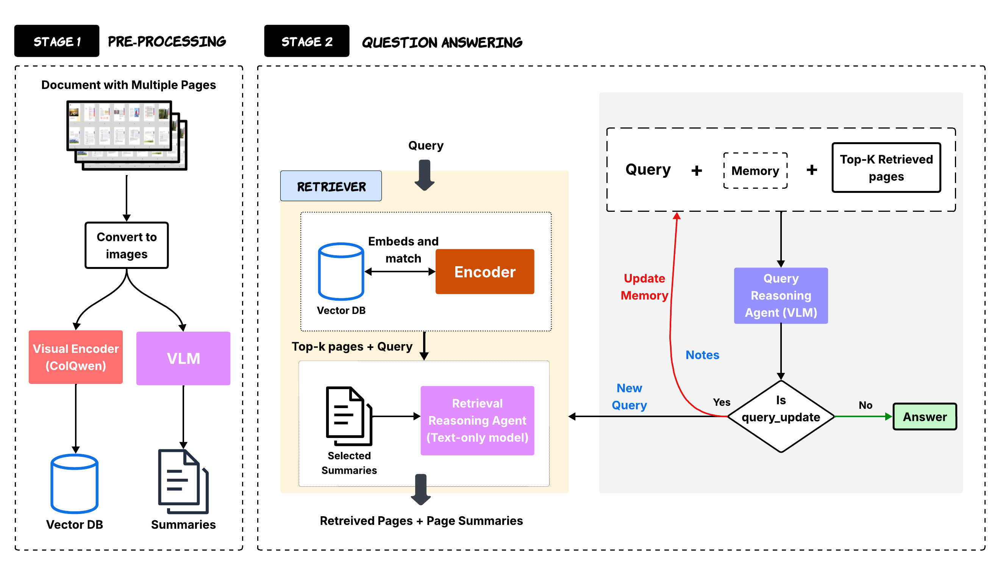

# SimpleDoc

**SimpleDoc** is a lightweight yet powerful Retrieval-Augmented Generation (RAG) framework for multi-modal document understanding, with a focus on Document Visual Question Answering (DocVQA). It introduces a dual-cue retrieval mechanism and an iterative reasoning agent that together outperform more complex multi-agent pipelines, using fewer document pages.

 <!-- Replace with actual image path -->

## Key Contributions

- **Dual-Cue Retrieval**: Combines page-level visual embeddings and LLM-generated summaries to retrieve and rerank relevant pages.
- **Iterative Reasoning**: A single VLM-based agent dynamically updates queries and working memory to iteratively refine answers.
- **Fewer Pages, Better Accuracy**: Achieves up to **70.12%** accuracy on DocVQA benchmarks while reading only ~3.5 pages per query.
- **Simple but Effective**: Outperforms multi-agent systems like MDocAgent and hybrid RAG pipelines like M3DocRAG on 3 out of 4 major benchmarks.


## Project Structure
<pre>

├── preprocess/                   # Offline embedding + summary extraction (Stage 1)
│   ├── generate_embeddings.py
│   └── generate_summaries.py

├── pipeline/                   
│   ├── groupchat_controller.py
│   └── run_simpledoc_chat.py

├── modules/                      # Dual-cue retrieval + Iterative QA and memory-based reasoning (Stage 2)
│   ├── step02_page_retrieval.py
│   └── step03_target_page_qa.py

├── prompts/                      # Prompt templates used for retrieval, QA, and memory update
│   ├── page_retrieval_prompt.txt
│   ├── general_summary_propmt.txt
│   └── doc_qa_prompt_v3.5.txt

├── scripts/                      # Bash scripts
│   ├── preprocess_embeddings.sh
│   ├── preprocess_summaries.sh
│   ├── run_simpledoc.sh

├── agent/                        # AG2-compatible single-agent wrapper (SimpleDocAgent)
│   ├── reasoning_agent.py
│   └── retriever_agent.py

├── utils/                        # Utility functions (e.g OpenAI client initialization)
│   ├── pipeline_utils.py
│   └── openai_helper.py

├── data/                         
│   ├── MMLongBench/
│   ├── LongDocURL/
│   ├── FetaTab/
│   └── PaperTab/

├── outputs/                      # Final pipeline outputs (answers + metadata)

└── README.md                     # Project documentation and usage guide
</pre>

## Method Overview

SimpleDoc operates in two distinct stages:

### 1. Offline Document Processing
- Extracts **visual embeddings** per page via models like **ColPali/ColQwen**.
- Generates **summaries** per page using LLMs prompted with structured instructions.
- Stores both into a retrievable vector DB.

### 2. Online Multi-Modal QA Loop
- Embeds a user query and retrieves top-*k* candidate pages by embedding similarity.
- Filters and **re-ranks** these using a summary-aware LLM.
- A **reasoning agent** decides whether the current context suffices to answer or if further refinement is needed.
- The process continues iteratively, updating working memory and queries until the answer is found or the query is deemed unanswerable.

## Quickstart

### 1. Clone the repository
```bash
git clone https://github.com/Chelsi-create/simpledoc.git
cd simpledoc
```

### 2. Environment Setup
Create and activate the conda environment, then install dependencies:
```bash
conda create -n simpledoc python=3.12
conda activate simpledoc
bash install.sh
```

### 3. Data Preparation
Create the data directory and download the dataset:
```bash
mkdir data
cd data
```

Make sure your data directory looks like this:
<pre>
simpledoc/
├── data/
│   └── MMLongBench/
│       ├── samples.json
│       └── documents/

</pre>


Download the dataset from [huggingface](https://huggingface.co/datasets/Lillianwei/Mdocagent-dataset) and place it in the data directory. The documents of PaperText are same as PaperTab. You can use symbol link or make a copy.

### 4. Run the Pipeline
Execute the pipeline in the following order using the provided scripts:
```bash
# Step 1: Generate LLM summaries
bash scripts/preprocess_summaries.sh

# Step 2: Generate visual embeddings
bash scripts/preprocess_embeddings.sh

# Step 3: Run the AG2-wrapped SimpleDoc multi-agent chat pipeline
bash scripts/run_simpledoc.sh
```
